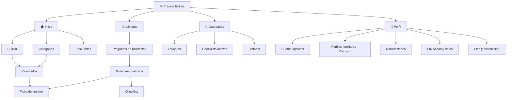
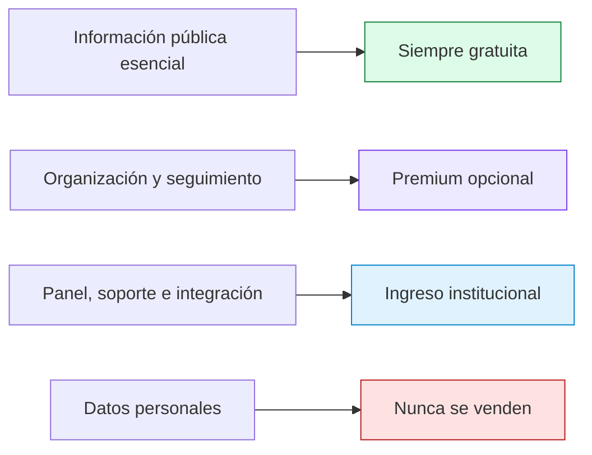
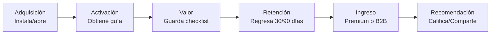
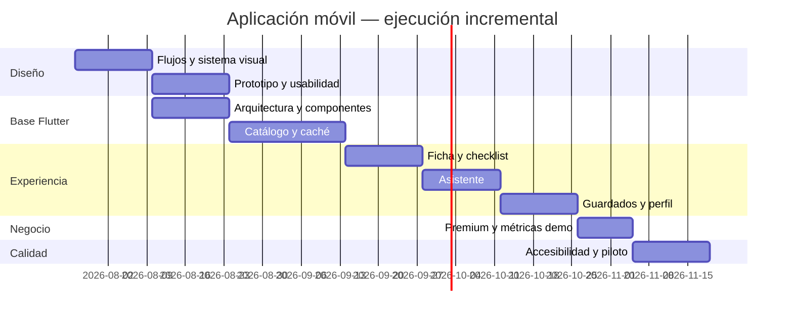

# Mi Trámite Bolivia — Requerimientos de la aplicación móvil

> **“Antes de hacer fila, sabrás qué preparar, dónde ir y qué verificar.”**

**Versión:** 1.0  
**Fecha:** 26 de julio de 2026  
**Plataforma objetivo:** Flutter para Android e iOS  
**Estado:** línea base para UX/UI, desarrollo y validación del MVP  
**Documento fuente:** `Proyecto_Final_Mi_Tramite_Bolivia_INF264.pdf`

---

## 1. Propósito del documento

Este documento convierte el informe académico y la definición técnica de
**Mi Trámite Bolivia** en requisitos concretos para diseñar y desarrollar una
aplicación móvil:

- visual, simple y amigable;
- útil con conectividad limitada;
- confiable y transparente sobre sus fuentes;
- preparada para funcionar sin registro en las tareas esenciales;
- capaz de demostrar un modelo de negocio sostenible;
- independiente de las instituciones públicas y claramente identificada como
  plataforma de orientación.

La aplicación **no ejecuta ni aprueba trámites**. Ayuda a descubrir el trámite,
preparar documentos, entender pasos y llegar al canal oficial correcto.

---

## 2. Visión rápida del producto

```mermaid
flowchart LR
    N["Tengo una necesidad"] --> B["Busco o pregunto"]
    B --> A["La app aclara mi caso"]
    A --> G["Recibo una guía verificable"]
    G --> C["Guardo mi checklist"]
    C --> R["Preparo documentos"]
    R --> O["Continúo en el canal oficial"]

    style N fill:#E0F2FE,stroke:#0284C7
    style G fill:#DCFCE7,stroke:#16A34A
    style C fill:#FEF3C7,stroke:#D97706
    style O fill:#EDE9FE,stroke:#7C3AED
```



### Promesa central

| Pregunta del ciudadano | Respuesta que debe ofrecer la app |
|---|---|
| ¿Qué trámite necesito? | Candidatos explicados en lenguaje claro |
| ¿Qué debo llevar? | Checklist general y condicional |
| ¿Cuánto cuesta? | Costo verificado, concepto y fecha |
| ¿Dónde lo hago? | Modalidad, oficina, horario y mapa |
| ¿Cuánto demora? | Plazo oficial o indicación de que no está confirmado |
| ¿Puedo confiar? | Institución, fuente y fecha de verificación visibles |
| ¿Qué hago después? | Pasos ordenados y enlace al canal oficial |

---

## 3. Alcance del producto

### 3.1 MVP ciudadano

- Bienvenida y explicación de independencia.
- Uso básico sin crear una cuenta.
- Inicio con buscador, categorías y trámites frecuentes.
- Búsqueda por texto, necesidad cotidiana, categoría o institución.
- Ficha estructurada de trámite.
- Asistente conversacional con respuestas en tarjetas.
- Preguntas de aclaración para requisitos condicionales.
- Checklist guardado y disponible sin conexión.
- Favoritos y trámites recientes.
- Ubicaciones y apertura en una aplicación de mapas.
- Reporte de datos posiblemente desactualizados.
- Perfil, privacidad y eliminación de historial.
- Registro opcional para sincronización.
- Oferta premium sin bloquear información pública esencial.

### 3.2 Funciones premium

- Sincronización del historial entre dispositivos.
- Perfiles familiares.
- Recordatorios avanzados.
- Alertas cuando cambia un requisito, costo, oficina o versión.
- Planes de acción que agrupen varios trámites relacionados.
- Mayor organización de checklists, notas y fechas.

### 3.3 Fuera del MVP

- Realizar el trámite dentro de la aplicación.
- Reservar una cita sin integración o convenio oficial.
- Recibir pagos destinados a una institución pública.
- Subir fotografías de cédulas, pasaportes u otros documentos personales.
- Prometer que una institución aceptará una solicitud.
- Emitir asesoramiento legal, tributario o administrativo vinculante.
- Integración con Ciudadanía Digital sin convenio y análisis legal.
- Implementación multiinstitución white-label completa.

---

## 4. Usuarios principales

### 👩‍🎓 Camila — Estudiante

```text
Necesita: legalizar documentos para una postulación.
Valora: respuestas directas, fuentes y checklist.
Teme: descubrir otro requisito después de hacer fila.
Uso típico: búsqueda → ficha → checklist → recordatorio.
```

### 👨‍💼 José — Trabajador independiente

```text
Necesita: formalizar una actividad económica.
Valora: secuencia entre trámites, costos y tiempos.
Pagaría por: plan de acción, recordatorios y perfiles de su equipo/familia.
Uso típico: asistente → ruta de trámites → plan guardado.
```

### 👩‍🦳 María — Cuidadora familiar

```text
Necesita: gestionar documentos de un adulto mayor.
Valora: pantallas simples, modo offline y ubicación exacta.
Necesita saber: qué requisitos cambian por edad o representación.
Uso típico: perfil familiar → guía adaptada → checklist offline.
```

### 🏛️ Institución o programa aliado

```text
Necesita: reducir consultas repetitivas y publicar información consistente.
Valora: panel, métricas agregadas, control editorial y trazabilidad.
Contrata: licencia institucional, white-label, API o consultoría.
```

---

## 5. Principios de experiencia de usuario

### 5.1 Simple antes que completo

La primera pantalla no debe mostrar toda la complejidad administrativa. Se
presenta una acción principal y se revela información a medida que sea necesaria.

### 5.2 Una pregunta a la vez

Cuando el trámite dependa de edad, ciudad, modalidad o tipo de solicitante, la
app realizará preguntas breves:

```text
¿Es tu primera licencia?

[ Sí, es la primera ]   [ No, quiero renovarla ]

¿En qué ciudad realizarás el trámite?

[ La Paz ▼ ]
```

Cada pregunta debe explicar opcionalmente por qué se solicita:

> “Esto cambia los requisitos y la oficina disponible.”

### 5.3 Confianza visible

Todas las fichas y respuestas incluirán:

- institución responsable;
- fecha de última verificación;
- estado de revisión;
- fuente oficial;
- advertencias;
- aviso cuando un dato no pudo confirmarse.

### 5.4 Información accionable

La app prioriza verbos y acciones:

- “Lleva el documento original”.
- “Haz una copia”.
- “Solicita una cita”.
- “Paga mediante el canal oficial”.
- “Abre la ubicación”.

### 5.5 Independencia clara

Debe aparecer un aviso comprensible:

> Mi Trámite Bolivia es una plataforma independiente de orientación. No
> representa a una institución pública ni aprueba trámites. Confirma siempre la
> información en la fuente oficial indicada.

No se utilizarán escudos, símbolos estatales o diseños que puedan hacer creer
que la aplicación es oficial.

---

## 6. Arquitectura de información y navegación

### 6.1 Navegación principal



### 6.2 Barra inferior

| Destino | Icono | Objetivo |
|---|---:|---|
| Inicio | 🏠 | Descubrir y buscar |
| Asistente | 💬 | Explicar una necesidad con palabras propias |
| Guardados | 🔖 | Continuar preparación y consultar offline |
| Perfil | 👤 | Preferencias, privacidad, cuenta y plan |

La barra debe mantenerse visible en los destinos principales y ocultarse en
flujos de concentración como onboarding, pago y conversación expandida.

---

## 7. Sistema visual propuesto

### 7.1 Personalidad

- Cercana, clara y respetuosa.
- Moderna sin parecer una banca o entidad estatal.
- Optimista, sin minimizar la dificultad de un trámite.
- Con ilustraciones funcionales, no decoraciones que distraigan.

### 7.2 Paleta accesible inicial

| Uso | Color | Hex |
|---|---|---|
| Primario | Azul confianza | `#2563EB` |
| Secundario | Turquesa orientación | `#0F9F8F` |
| Éxito | Verde | `#15803D` |
| Advertencia | Ámbar | `#B45309` |
| Error | Rojo | `#B91C1C` |
| Fondo | Gris muy claro | `#F8FAFC` |
| Superficie | Blanco | `#FFFFFF` |
| Texto principal | Azul pizarra | `#0F172A` |
| Texto secundario | Gris | `#475569` |

Todos los pares de texto y fondo deben cumplir contraste WCAG 2.1 AA.

### 7.3 Tipografía

- Fuente principal: Inter, Roboto o fuente de sistema.
- Texto base mínimo: 16 px lógico.
- Encabezados claros, máximo tres niveles por pantalla.
- Soporte para escalado de fuente del sistema hasta 200 %.
- No colocar información indispensable dentro de una imagen.

### 7.4 Iconografía

- Iconos simples y acompañados de texto cuando la acción no sea universal.
- Logos institucionales como apoyo visual, no como sustituto del nombre.
- Cada logo debe incluir texto alternativo.
- No usar color como único indicador de estado.

### 7.5 Componentes base

```text
┌──────────────────────────────────┐
│ [LOGO]  SEGIP                    │
│ Renovación de cédula             │
│                                  │
│ 🟢 Verificado: 20 jul 2026       │
│ 🏢 Presencial                    │
│ 💵 Costo verificado: Bs. XX      │
│                                  │
│ [ Ver requisitos ]              │
└──────────────────────────────────┘
```

Componentes requeridos:

- tarjeta de trámite;
- chip de modalidad;
- sello de verificación;
- tarjeta de fuente;
- requisito marcable;
- paso numerado;
- tarjeta de costo;
- oficina/mapa;
- alerta y advertencia;
- estado vacío;
- skeleton de carga;
- banner offline;
- CTA premium;
- comparador de planes;
- medidor de progreso.

---

## 8. Wireframes de las pantallas

### 8.1 Bienvenida

```text
┌──────────────────────────────────┐
│                                  │
│       [Mi Trámite Bolivia]       │
│                                  │
│  Prepárate antes de hacer fila   │
│                                  │
│  ✓ Requisitos claros             │
│  ✓ Fuentes oficiales             │
│  ✓ Checklist para llevar         │
│                                  │
│ [ Explorar sin registrarme ]     │
│ [ Crear cuenta opcional ]        │
│                                  │
│ Plataforma independiente ⓘ       │
└──────────────────────────────────┘
```

### 8.2 Inicio

```text
┌──────────────────────────────────┐
│ Hola 👋 ¿Qué necesitas hacer?    │
│ ┌──────────────────────────────┐ │
│ │ 🔍 Ej. sacar mi NIT          │ │
│ └──────────────────────────────┘ │
│                                  │
│ [💬 Preguntar al asistente]      │
│                                  │
│ Categorías                       │
│ [Identidad] [Empresas] [Viajes] │
│ [Impuestos] [Familia]  [Más]    │
│                                  │
│ Trámites frecuentes              │
│ ┌──────────┐  ┌──────────┐      │
│ │ Cédula   │  │ Pasaporte│      │
│ └──────────┘  └──────────┘      │
│                                  │
│ 🏠      💬      🔖      👤       │
└──────────────────────────────────┘
```

### 8.3 Resultados

```text
┌──────────────────────────────────┐
│ ← “abrir un negocio”             │
│                                  │
│ 4 resultados                     │
│ [Institución ▼] [Modalidad ▼]    │
│                                  │
│ ┌──────────────────────────────┐ │
│ │ Inscripción empresa          │ │
│ │ SEPREC · En línea            │ │
│ │ Verificado hace 5 días       │ │
│ └──────────────────────────────┘ │
│ ┌──────────────────────────────┐ │
│ │ Obtener NIT                  │ │
│ │ SIN · En línea/presencial    │ │
│ │ Verificado hace 12 días      │ │
│ └──────────────────────────────┘ │
└──────────────────────────────────┘
```

### 8.4 Ficha del trámite

```text
┌──────────────────────────────────┐
│ ←                         ☆      │
│ [Logo] SEPREC                    │
│ Inscripción de empresa           │
│                                  │
│ 🟢 Verificado el 25/07/2026      │
│ [En línea] [Persona natural]     │
│                                  │
│ [Preparar mi checklist]          │
│                                  │
│ Resumen                          │
│ Requisitos (3)             ›     │
│ Pasos (4)                  ›     │
│ Costos                     ›     │
│ Resultado y plazo          ›     │
│ Oficinas / canal oficial   ›     │
│                                  │
│ ⚠ Advertencias                   │
│ [Ver fuente oficial ↗]           │
│ [Reportar un cambio]             │
└──────────────────────────────────┘
```

### 8.5 Asistente

```text
┌──────────────────────────────────┐
│ ← Asistente confiable       ⓘ    │
│                                  │
│ 🤖 ¿Qué trámite necesitas hacer? │
│                                  │
│ 👤 Quiero sacar una licencia     │
│                                  │
│ 🤖 Para orientarte mejor:        │
│    ¿es la primera vez?           │
│                                  │
│ [ Primera vez ] [ Renovación ]   │
│                                  │
│ ┌──────────────────────────────┐ │
│ │ Escribe tu respuesta...  ➤   │ │
│ └──────────────────────────────┘ │
│ La IA puede equivocarse.         │
│ Verifica las fuentes indicadas.  │
└──────────────────────────────────┘
```

### 8.6 Respuesta estructurada

```text
┌──────────────────────────────────┐
│ Tu guía para primera licencia    │
│                                  │
│ Antes de continuar               │
│ ✓ Caso: primera emisión          │
│ ✓ Ciudad: La Paz                 │
│                                  │
│ [Requisitos 6] [Pasos 4]         │
│                                  │
│ ⚠ Falta confirmar una condición  │
│                                  │
│ Fuente: SEGELIC                  │
│ Verificada: 25/07/2026           │
│                                  │
│ [Guardar checklist]              │
│ [Abrir ficha completa]           │
│                                  │
│ ¿Te sirvió?  👍  👎              │
└──────────────────────────────────┘
```

### 8.7 Checklist

```text
┌──────────────────────────────────┐
│ ← Mi checklist             3/6   │
│ ██████████░░░░░░ 50 %            │
│                                  │
│ ☑ Cédula de identidad original   │
│ ☑ Fotocopia de cédula            │
│ ☐ Certificado requerido          │
│    Válido por: 90 días            │
│ ☐ Comprobante de pago            │
│                                  │
│ [+ Agregar nota personal]        │
│ [⏰ Crear recordatorio]           │
│                                  │
│ Disponible sin conexión ✓        │
└──────────────────────────────────┘
```

### 8.8 Guardados

```text
┌──────────────────────────────────┐
│ Guardados                        │
│ [Activos] [Favoritos] [Historial]│
│                                  │
│ Formalizar mi negocio            │
│ 2 de 3 trámites preparados       │
│ ████████████░░ 67 %              │
│                                  │
│ Renovar cédula                   │
│ Checklist 3/4 · Actualizado hoy  │
│                                  │
│ 🏠      💬      🔖      👤       │
└──────────────────────────────────┘
```

### 8.9 Plan premium

```text
┌──────────────────────────────────┐
│ Organiza mejor tus trámites      │
│                                  │
│ Gratis                           │
│ ✓ Información y fuentes          │
│ ✓ Checklist local                │
│ ✓ Asistente básico               │
│                                  │
│ Premium · Bs. 20/mes             │
│ ✓ Sincronización                 │
│ ✓ Perfiles familiares            │
│ ✓ Alertas de cambios              │
│ ✓ Recordatorios avanzados        │
│                                  │
│ [Probar Premium]                 │
│ [Continuar con Gratis]           │
└──────────────────────────────────┘
```

### 8.10 Perfil y privacidad

```text
┌──────────────────────────────────┐
│ Perfil                           │
│                                  │
│ Cuenta y sincronización      ›    │
│ Mi plan                      ›    │
│ Perfiles familiares          ›    │
│ Notificaciones               ›    │
│ Idioma y accesibilidad       ›    │
│ Datos sin conexión           ›    │
│ Privacidad e IA              ›    │
│ Eliminar historial           ›    │
│                                  │
│ Acerca de la independencia   ›    │
└──────────────────────────────────┘
```

---

## 9. Requerimientos funcionales de la app

### 9.1 Inicio y onboarding

- **APP-ONB-001 — Alta:** la app debe explicar su propuesta en un máximo de
  tres beneficios.
- **APP-ONB-002 — Alta:** debe mostrar el aviso de independencia antes del
  primer uso.
- **APP-ONB-003 — Alta:** debe permitir continuar sin registro.
- **APP-ONB-004 — Media:** debe permitir elegir ciudad inicial, con opción
  “prefiero no indicar”.
- **APP-ONB-005 — Media:** debe explicar brevemente cómo usa IA y enlazar su
  política completa.
- **APP-ONB-006 — Alta:** la omisión del registro no debe bloquear búsqueda,
  ficha, fuente o checklist local.

**Criterio de aceptación**

> Una persona nueva puede llegar al inicio sin proporcionar nombre, teléfono,
> correo, CI ni ubicación precisa.

### 9.2 Inicio

- **APP-INI-001 — Alta:** mostrar campo de búsqueda como acción principal.
- **APP-INI-002 — Alta:** ofrecer acceso visible al asistente.
- **APP-INI-003 — Alta:** mostrar categorías activas.
- **APP-INI-004 — Media:** mostrar trámites frecuentes según catálogo y no por
  perfilamiento personal oculto.
- **APP-INI-005 — Media:** mostrar checklists pendientes cuando existan.
- **APP-INI-006 — Alta:** indicar modo sin conexión cuando se use caché.
- **APP-INI-007 — Baja:** presentar contenido educativo o novedades verificadas.

### 9.3 Búsqueda

- **APP-BUS-001 — Alta:** buscar por nombre, alias, necesidad cotidiana,
  categoría e institución.
- **APP-BUS-002 — Alta:** tolerar mayúsculas, acentos y errores simples.
- **APP-BUS-003 — Alta:** mostrar institución, modalidad y verificación en cada
  resultado.
- **APP-BUS-004 — Alta:** filtrar por institución, categoría, modalidad y ciudad.
- **APP-BUS-005 — Media:** conservar búsquedas recientes localmente.
- **APP-BUS-006 — Alta:** mostrar sugerencias cuando no haya coincidencia.
- **APP-BUS-007 — Media:** permitir iniciar el asistente con la búsqueda escrita.
- **APP-BUS-008 — Alta:** nunca incluir borradores o versiones retiradas.

**Estado vacío**

```text
No encontramos un trámite verificado para “tu consulta”.

[Preguntar al asistente] [Explorar categorías]
```

### 9.4 Ficha del trámite

- **APP-FIC-001 — Alta:** mostrar título, institución y logo accesible.
- **APP-FIC-002 — Alta:** mostrar resumen en lenguaje claro.
- **APP-FIC-003 — Alta:** mostrar modalidad: en línea, presencial o mixta.
- **APP-FIC-004 — Alta:** mostrar requisitos obligatorios y opcionales.
- **APP-FIC-005 — Alta:** diferenciar requisitos condicionales.
- **APP-FIC-006 — Alta:** mostrar pasos en orden.
- **APP-FIC-007 — Alta:** mostrar costo por concepto y condición.
- **APP-FIC-008 — Alta:** diferenciar “gratuito” de “sin dato confirmado”.
- **APP-FIC-009 — Alta:** mostrar plazo como referencia, no como garantía.
- **APP-FIC-010 — Alta:** mostrar resultado obtenido.
- **APP-FIC-011 — Alta:** mostrar oficinas y horarios verificados.
- **APP-FIC-012 — Alta:** mostrar fecha de verificación y próxima revisión.
- **APP-FIC-013 — Alta:** abrir la fuente oficial en navegador seguro.
- **APP-FIC-014 — Alta:** crear un checklist asociado a la versión publicada.
- **APP-FIC-015 — Media:** guardar como favorito.
- **APP-FIC-016 — Media:** compartir enlace estable.
- **APP-FIC-017 — Alta:** reportar información posiblemente incorrecta.
- **APP-FIC-018 — Alta:** advertir cuando la revisión esté vencida.

### 9.5 Asistente inteligente

- **APP-IA-001 — Alta:** aceptar una necesidad en lenguaje natural.
- **APP-IA-002 — Alta:** realizar únicamente preguntas necesarias.
- **APP-IA-003 — Alta:** presentar respuestas mediante tarjetas estructuradas.
- **APP-IA-004 — Alta:** incluir trámites sugeridos y explicar por qué.
- **APP-IA-005 — Alta:** incluir requisitos, pasos y advertencias trazables.
- **APP-IA-006 — Alta:** mostrar fuente y fecha.
- **APP-IA-007 — Alta:** abstenerse si no existe información suficiente.
- **APP-IA-008 — Alta:** no responder temas ajenos a trámites bolivianos.
- **APP-IA-009 — Alta:** no pedir números completos de documentos.
- **APP-IA-010 — Alta:** permitir crear checklist desde la guía.
- **APP-IA-011 — Media:** permitir valoración positiva o negativa.
- **APP-IA-012 — Media:** permitir reportar respuesta desactualizada.
- **APP-IA-013 — Alta:** mostrar aviso de que la IA puede equivocarse.
- **APP-IA-014 — Alta:** ofrecer búsqueda estructurada si el proveedor falla.
- **APP-IA-015 — Alta:** nunca afirmar que el trámite fue aprobado o completado.

**Respuesta de abstención**

> No puedo confirmarlo con las fuentes registradas. Puedes abrir el sitio
> oficial o buscar otro trámite relacionado.

### 9.6 Checklist y progreso

- **APP-CHK-001 — Alta:** crear checklist desde una versión concreta.
- **APP-CHK-002 — Alta:** marcar y desmarcar requisitos.
- **APP-CHK-003 — Alta:** mostrar progreso numérico y visual.
- **APP-CHK-004 — Alta:** funcionar sin conexión.
- **APP-CHK-005 — Media:** guardar notas personales sin subirlas por defecto.
- **APP-CHK-006 — Media:** crear recordatorios locales.
- **APP-CHK-007 — Alta:** advertir si existe una versión nueva del trámite.
- **APP-CHK-008 — Alta:** no reemplazar silenciosamente la lista anterior.
- **APP-CHK-009 — Media:** permitir comparar la versión guardada con la nueva.
- **APP-CHK-010 — Media:** archivar o eliminar el checklist.
- **APP-CHK-011 — Premium:** sincronizar entre dispositivos.
- **APP-CHK-012 — Premium:** agrupar varios trámites en un plan de acción.

### 9.7 Oficinas y ubicación

- **APP-UBI-001 — Alta:** mostrar dirección, referencia y municipio.
- **APP-UBI-002 — Alta:** mostrar horario por día y excepciones conocidas.
- **APP-UBI-003 — Alta:** mostrar fecha de verificación de la oficina.
- **APP-UBI-004 — Media:** ordenar por cercanía solo con permiso.
- **APP-UBI-005 — Alta:** abrir coordenadas en una app externa de navegación.
- **APP-UBI-006 — Alta:** no pedir ubicación precisa para usar el catálogo.
- **APP-UBI-007 — Media:** permitir reportar oficina cerrada o dirección errónea.
- **APP-UBI-008 — Alta:** indicar si requiere cita.

### 9.8 Guardados e historial

- **APP-GUA-001 — Alta:** mostrar checklists activos.
- **APP-GUA-002 — Alta:** mostrar favoritos.
- **APP-GUA-003 — Media:** mostrar historial reciente.
- **APP-GUA-004 — Alta:** permitir eliminar cada elemento.
- **APP-GUA-005 — Alta:** permitir eliminar todo el historial.
- **APP-GUA-006 — Media:** filtrar por activo, completado y archivado.
- **APP-GUA-007 — Premium:** sincronizar historial con una cuenta.

### 9.9 Cuenta y autenticación

- **APP-AUT-001 — Alta:** la cuenta será opcional para las funciones gratuitas
  esenciales.
- **APP-AUT-002 — Media:** permitir acceso con correo o teléfono mediante código
  de un solo uso cuando el backend lo habilite.
- **APP-AUT-003 — Alta:** guardar tokens en almacenamiento seguro.
- **APP-AUT-004 — Alta:** cerrar sesión sin borrar checklists locales salvo
  solicitud explícita.
- **APP-AUT-005 — Alta:** permitir eliminar la cuenta y datos sincronizados.
- **APP-AUT-006 — Alta:** informar qué datos se sincronizarán antes de crear la
  cuenta.

### 9.10 Notificaciones

- **APP-NOT-001 — Alta:** solicitar permiso después de explicar el beneficio.
- **APP-NOT-002 — Gratis:** permitir recordatorios locales básicos.
- **APP-NOT-003 — Premium:** alertar cambios de requisitos, costos y oficinas.
- **APP-NOT-004 — Premium:** permitir recordatorios recurrentes o múltiples.
- **APP-NOT-005 — Alta:** configurar categorías de notificación.
- **APP-NOT-006 — Alta:** abrir directamente el checklist o cambio relacionado.
- **APP-NOT-007 — Alta:** no incluir información sensible en la pantalla bloqueada.

### 9.11 Reportes ciudadanos

- **APP-REP-001 — Alta:** reportar dato incorrecto, desactualizado, costo
  diferente, requisito diferente u oficina cerrada.
- **APP-REP-002 — Alta:** permitir reporte anónimo.
- **APP-REP-003 — Media:** adjuntar evidencia no sensible cuando se habilite.
- **APP-REP-004 — Alta:** advertir que no deben subirse documentos personales.
- **APP-REP-005 — Alta:** confirmar recepción sin prometer modificación.
- **APP-REP-006 — Media:** mostrar estado si el usuario inició sesión.

### 9.12 Privacidad y accesibilidad

- **APP-PRI-001 — Alta:** mostrar política de privacidad y uso de IA.
- **APP-PRI-002 — Alta:** permitir eliminar historial local y sincronizado.
- **APP-PRI-003 — Alta:** permitir retirar consentimiento analítico.
- **APP-PRI-004 — Alta:** no almacenar imágenes de documentos en el MVP.
- **APP-PRI-005 — Alta:** ser compatible con TalkBack y VoiceOver.
- **APP-PRI-006 — Alta:** respetar tamaño de fuente, contraste y movimiento
  reducido.
- **APP-PRI-007 — Media:** incluir modo de interfaz simplificada.
- **APP-PRI-008 — Alta:** todos los logos e imágenes deben tener texto alternativo.

---

## 10. Requisitos de monetización

### 10.1 Principio ético



La aplicación no cobrará por:

- consultar requisitos;
- conocer costos y pasos;
- abrir fuentes oficiales;
- conocer oficinas;
- usar un checklist local básico;
- reportar un dato incorrecto.

La monetización no dependerá de vender datos personales, ocultar información
pública, publicidad engañosa ni cobrar una comisión sobre pagos estatales.

### 10.2 Fuentes de ingreso descritas en el informe

| Fuente | Precio referencial | Valor entregado | Cliente |
|---|---:|---|---|
| Plan ciudadano premium | **Bs. 20/mes** | Perfiles familiares, alertas, historial sincronizado y recordatorios avanzados | B2C |
| Licencia institucional básica | **Bs. 2.000/mes** | Panel, métricas agregadas y soporte para una entidad o programa | B2B |
| Implementación white-label | **Bs. 8.000–20.000** | Identidad, configuración, catálogo inicial e integración | B2B |
| API y analítica agregada | **Bs. 1.000–3.000/mes** | Catálogo controlado y tendencias no personales | B2B |
| Capacitación y consultoría | **Según alcance** | Digitalización, modelado de trámites y contenido claro | Servicio |

Los precios son referenciales para el proyecto académico y deberán validarse
antes de una venta real.

### 10.3 Matriz gratuita vs. premium

| Funcionalidad | Gratis | Premium |
|---|:---:|:---:|
| Buscar y consultar trámites | ✅ | ✅ |
| Ver fuentes oficiales | ✅ | ✅ |
| Asistente básico | ✅ | ✅ |
| Checklist local | ✅ | ✅ |
| Favoritos locales | ✅ | ✅ |
| Recordatorio local básico | ✅ | ✅ |
| Sincronización multidispositivo | — | ✅ |
| Historial sincronizado | — | ✅ |
| Perfiles familiares | — | ✅ |
| Alertas automáticas de cambios | — | ✅ |
| Recordatorios múltiples/avanzados | — | ✅ |
| Planes con varios trámites | — | ✅ |

### 10.4 Requisitos del plan premium

- **APP-MON-001 — Alta:** mostrar claramente precio, periodo y funciones.
- **APP-MON-002 — Alta:** permitir continuar con el plan gratuito sin fricción.
- **APP-MON-003 — Alta:** no usar patrones oscuros, cuenta regresiva falsa o
  casillas preseleccionadas.
- **APP-MON-004 — Alta:** mostrar condiciones de renovación y cancelación.
- **APP-MON-005 — Alta:** restaurar compras o suscripción según la plataforma.
- **APP-MON-006 — Alta:** validar la compra en backend, nunca solo en el cliente.
- **APP-MON-007 — Alta:** conservar acceso gratuito al finalizar Premium.
- **APP-MON-008 — Alta:** exportar o eliminar datos creados durante Premium.
- **APP-MON-009 — Media:** ofrecer prueba gratuita solo si sus condiciones son
  explícitas.
- **APP-MON-010 — Alta:** cumplir las reglas de facturación vigentes de cada
  tienda antes del lanzamiento.

### 10.5 Licencia institucional

La app ciudadana debe poder mostrar contenido gestionado por instituciones
licenciadas sin convertirlo en publicidad encubierta.

- **APP-B2B-001:** identificar contenido validado por la institución.
- **APP-B2B-002:** mantener fuente y fecha aunque exista contrato.
- **APP-B2B-003:** no mejorar artificialmente el ranking por pago.
- **APP-B2B-004:** permitir temática/branding limitado en implementaciones
  white-label.
- **APP-B2B-005:** separar métricas agregadas de datos personales.
- **APP-B2B-006:** obtener consentimiento antes de enviar analítica identificable.

### 10.6 API y analítica

La analítica vendible debe ser agregada, por ejemplo:

- trámites más consultados;
- términos de búsqueda sin resultado;
- ciudades seleccionadas de forma agregada;
- pasos que generan más dudas;
- porcentaje de checklists iniciados y completados;
- reportes de desactualización por categoría;
- tiempo medio hasta obtener una guía.

Queda prohibido comercializar:

- conversaciones completas;
- identificadores personales;
- ubicación precisa;
- documentos;
- perfiles familiares;
- historial individual.

### 10.7 Demostración de ingresos

Para la defensa del emprendimiento se requiere un **modo demostración** que use
datos claramente etiquetados como simulados y permita mostrar:

```text
┌────────────────────────────────────────────┐
│ Indicadores del emprendimiento · DEMO      │
├────────────────────────────────────────────┤
│ MRR actual                     Bs. 6.012   │
│ Instituciones activas                   2   │
│ Suscriptores premium                  134   │
│ Conversión premium                   2,7%   │
│ Costo operativo mensual         Bs. 6.000   │
│ Margen operativo estimado          Bs. 12   │
│ Punto de equilibrio                 100 %   │
└────────────────────────────────────────────┘
```

Escenarios del informe:

| Escenario | Cálculo | Contribución |
|---|---:|---:|
| Institucional | 4 × Bs. 1.800 | Bs. 7.200 |
| Mixto | 2 × Bs. 1.800 + 134 × Bs. 18 | Bs. 6.012 |
| Ciudadano | 334 × Bs. 18 | Bs. 6.012 |

- **APP-REV-001:** separar ingresos reales de datos demo.
- **APP-REV-002:** calcular MRR por fuente.
- **APP-REV-003:** mostrar suscriptores activos, nuevos y cancelados.
- **APP-REV-004:** mostrar conversión de gratuito a premium.
- **APP-REV-005:** calcular ingreso medio por usuario pagador.
- **APP-REV-006:** registrar clientes institucionales activos.
- **APP-REV-007:** comparar contribución con costo operativo mensual.
- **APP-REV-008:** mostrar avance hacia punto de equilibrio.
- **APP-REV-009:** filtrar por periodo y fuente de ingreso.
- **APP-REV-010:** exportar un resumen para la presentación académica.

El tablero financiero corresponde principalmente al panel administrativo; la app
ciudadana solo presenta su plan, compra y estado de suscripción.

---

## 11. Analítica del producto

### 11.1 Embudo



### 11.2 Eventos mínimos

| Evento | Propósito | Datos permitidos |
|---|---|---|
| `app_opened` | Apertura | versión, plataforma |
| `search_submitted` | Demanda | consulta redactada/anonimizada |
| `search_no_results` | Brecha de catálogo | término normalizado |
| `procedure_opened` | Interés | ID del trámite/version |
| `source_opened` | Confianza | ID de fuente |
| `guidance_completed` | Activación | trámite, latencia |
| `checklist_created` | Valor | trámite/version |
| `checklist_completed` | Resultado | trámite/version, duración agregada |
| `change_reported` | Calidad | tipo de reporte |
| `premium_viewed` | Intención de pago | origen |
| `checkout_started` | Conversión | plan |
| `subscription_activated` | Ingreso | plan, periodo, sin datos de tarjeta |
| `subscription_cancelled` | Churn | motivo opcional |

### 11.3 Indicadores del informe

- preparación completa;
- resolución en primer intento;
- tiempo para obtener una orientación;
- exactitud del contenido;
- respuestas con fuente;
- satisfacción;
- costo de adquisición;
- activación por checklist guardado;
- retención a 30 y 90 días;
- conversión premium;
- MRR;
- instituciones activas;
- tiempo medio de actualización.

La resolución en primer intento y preparación completa requieren encuesta
posterior voluntaria; no deben inferirse sin evidencia.

---

## 12. Requisitos no funcionales

### 12.1 Rendimiento

- **APP-RNF-001:** iniciar en menos de 3 segundos en Android de gama media.
- **APP-RNF-002:** búsqueda no generativa percibida en menos de 2 segundos.
- **APP-RNF-003:** mostrar skeleton si una carga supera 300 ms.
- **APP-RNF-004:** comprimir imágenes y utilizar variantes adecuadas.
- **APP-RNF-005:** paginar resultados y listas extensas.
- **APP-RNF-006:** cancelar peticiones al abandonar una pantalla.

### 12.2 Conectividad y modo offline

- **APP-RNF-010:** cachear fichas consultadas recientemente.
- **APP-RNF-011:** conservar checklists localmente.
- **APP-RNF-012:** identificar contenido obtenido desde caché.
- **APP-RNF-013:** mostrar fecha de la copia local.
- **APP-RNF-014:** sincronizar cambios cuando vuelva la red.
- **APP-RNF-015:** resolver conflictos sin perder progreso.
- **APP-RNF-016:** el asistente puede requerir conexión; debe ofrecer la ficha
  guardada como alternativa.

### 12.3 Seguridad

- **APP-RNF-020:** usar TLS.
- **APP-RNF-021:** no conectarse directamente a Neon ni a proveedores de IA.
- **APP-RNF-022:** guardar tokens en Flutter Secure Storage.
- **APP-RNF-023:** no incluir secretos en la aplicación.
- **APP-RNF-024:** validar deep links y URLs antes de abrirlos.
- **APP-RNF-025:** impedir capturas en pantallas sensibles si en el futuro se
  manejan datos que lo justifiquen.
- **APP-RNF-026:** aplicar certificate pinning solo con estrategia segura de
  rotación; no es obligatorio para el MVP.
- **APP-RNF-027:** ocultar PII en logs y reportes de errores.
- **APP-RNF-028:** validar compras y suscripciones en backend.

### 12.4 Privacidad

- Orientación anónima por defecto.
- Analítica opcional y configurable.
- Retención mínima.
- Eliminación de cuenta e historial.
- No usar conversaciones para entrenamiento sin consentimiento específico.
- No solicitar fotografías de documentos.
- No vender datos personales.

### 12.5 Accesibilidad

- WCAG 2.1 AA como referencia.
- Semántica para lectores de pantalla.
- Objetivos táctiles mínimos de 44 × 44 puntos lógicos.
- Foco visible y orden correcto.
- Textos escalables.
- Mensajes que no dependan únicamente de color.
- Animaciones reducibles.
- Lenguaje claro y frases cortas.

### 12.6 Calidad y disponibilidad

- **APP-RNF-040:** objetivo de disponibilidad del piloto: 99 %.
- **APP-RNF-041:** la app debe degradar a catálogo cuando falle IA.
- **APP-RNF-042:** los errores deben incluir acción de recuperación.
- **APP-RNF-043:** Sentry o equivalente no debe capturar conversaciones sin
  redacción.
- **APP-RNF-044:** compatibilidad inicial con Android de gama media y las
  versiones de iOS definidas antes del desarrollo.

---

## 13. Arquitectura Flutter propuesta

```text
lib/
├── app/
│   ├── router/
│   ├── theme/
│   └── localization/
├── core/
│   ├── network/
│   ├── storage/
│   ├── analytics/
│   ├── errors/
│   └── widgets/
├── features/
│   ├── onboarding/
│   ├── catalog/
│   ├── assistant/
│   ├── checklist/
│   ├── saved/
│   ├── locations/
│   ├── reports/
│   ├── auth/
│   ├── profile/
│   └── monetization/
└── main.dart
```

### Tecnologías

| Área | Elección |
|---|---|
| UI | Flutter + Material 3 personalizado |
| Estado/DI | Riverpod |
| Navegación | go_router |
| HTTP | Dio |
| Base local | Drift |
| Tokens | Flutter Secure Storage |
| Modelos | freezed/json_serializable o equivalente |
| Conectividad | connectivity_plus como señal, no como garantía |
| Mapas | Intent/deep link a proveedor instalado en el MVP |
| Notificaciones | Locales inicialmente; push cuando exista backend |
| Pruebas | flutter_test e integration_test |

La UI nunca debe consumir Neon, Gemini o Qwen directamente. Todo acceso pasa por
la API Go.

---

## 14. Contratos requeridos al backend

La app necesita como mínimo:

```text
GET  /api/v1/tramites
GET  /api/v1/tramites/{slug}
GET  /api/v1/tramites/{slug}/oficinas
GET  /api/v1/instituciones
GET  /api/v1/categorias

POST /api/v1/chat/conversaciones
POST /api/v1/chat/conversaciones/{id}/mensajes
POST /api/v1/mensajes/{id}/feedback

POST /api/v1/reportes

POST /api/v1/auth/otp/solicitar
POST /api/v1/auth/otp/verificar
POST /api/v1/auth/refresh
POST /api/v1/auth/logout

GET/POST/PUT/DELETE /api/v1/me/checklists
GET/POST/DELETE     /api/v1/me/favoritos
GET/DELETE          /api/v1/me/historial
GET/PUT             /api/v1/me/preferencias

GET  /api/v1/planes
POST /api/v1/suscripciones/verificar
GET  /api/v1/me/suscripcion
POST /api/v1/me/suscripcion/cancelar
```

Todos los DTO deben utilizar JSON normal. No se aceptarán requisitos codificados
en Base64 ni campos cuya estructura cambie entre lista y detalle.

---

## 15. Reglas de negocio de la app

- **APP-RN-001:** la información pública esencial es gratuita.
- **APP-RN-002:** Premium vende conveniencia, no acceso a derechos.
- **APP-RN-003:** una guía siempre referencia una versión publicada.
- **APP-RN-004:** una actualización no modifica silenciosamente un checklist.
- **APP-RN-005:** un dato sin verificación no se presenta como confirmado.
- **APP-RN-006:** la IA no es fuente oficial.
- **APP-RN-007:** un reporte ciudadano no modifica el catálogo.
- **APP-RN-008:** una institución que paga no obtiene mejor posicionamiento.
- **APP-RN-009:** la ubicación precisa requiere consentimiento.
- **APP-RN-010:** los perfiles familiares no almacenan documentos.
- **APP-RN-011:** cancelar Premium no elimina datos sin confirmación.
- **APP-RN-012:** la app no afirma que un trámite fue completado.
- **APP-RN-013:** el historial puede eliminarse.
- **APP-RN-014:** las métricas financieras demo se etiquetan como simuladas.
- **APP-RN-015:** los precios se obtienen del backend y no se codifican de forma
  permanente en la app.

---

## 16. Estados de interfaz

Cada pantalla con datos remotos debe contemplar:

| Estado | Comportamiento |
|---|---|
| Inicial | Contenido principal y CTA claros |
| Cargando | Skeleton, sin bloquear navegación completa |
| Vacío | Explicación y próxima acción |
| Sin conexión | Caché, fecha y opción de reintentar |
| Error recuperable | Mensaje humano + botón |
| Error definitivo | Canal de soporte o regreso seguro |
| Datos vencidos | Advertencia visible |
| Éxito | Confirmación breve, sin pantalla innecesaria |

Ejemplo:

```text
📡 Estás sin conexión

Mostramos la información guardada el 24/07/2026.

[Reintentar] [Continuar offline]
```

---

## 17. Historias de usuario y aceptación

### HU-01 — Encontrar un trámite

> Como ciudadano, quiero describir mi necesidad con mis propias palabras para
> encontrar el trámite adecuado.

**Aceptación**

- La búsqueda entiende aliases frecuentes.
- El resultado muestra institución y verificación.
- Si no existe resultado, ofrece asistente y categorías.

### HU-02 — Recibir requisitos aplicables

> Como ciudadano, quiero responder preguntas breves para recibir una lista
> correspondiente a mi caso.

**Aceptación**

- Se pregunta una condición a la vez.
- La interfaz explica por qué se pregunta.
- La respuesta diferencia requisitos confirmados y pendientes.

### HU-03 — Preparar documentos

> Como ciudadano, quiero guardar un checklist y continuarlo sin conexión.

**Aceptación**

- El progreso persiste después de cerrar la app.
- La ficha y lista muestran su versión.
- Se advierte cuando la versión cambia.

### HU-04 — Verificar la información

> Como ciudadano, quiero ver fuente y fecha para decidir si confío en la guía.

**Aceptación**

- La fuente está a máximo un toque desde ficha o guía.
- La URL se abre mediante HTTPS cuando esté disponible.
- Una revisión vencida genera advertencia.

### HU-05 — Usar Premium sin perder acceso gratuito

> Como usuario, quiero conocer los beneficios premium sin que la app bloquee la
> información pública.

**Aceptación**

- Existe comparación clara.
- “Continuar gratis” tiene visibilidad equivalente.
- Cancelar conserva las funciones gratuitas.

### HU-06 — Gestionar un familiar

> Como cuidadora, quiero separar los checklists de mis familiares.

**Aceptación**

- El perfil usa nombre corto o alias.
- No solicita CI ni fotografía.
- Cambiar perfil cambia guardados, no las fuentes del catálogo.

---

## 18. Plan de pruebas

### 18.1 Usabilidad

Realizar pruebas con al menos diez participantes de los perfiles definidos.

Tareas:

1. localizar un trámite;
2. obtener una guía personalizada;
3. guardar y completar parte de un checklist;
4. identificar la fuente oficial;
5. distinguir una función gratis de una premium.

Medir:

- éxito por tarea;
- tiempo;
- errores;
- comprensión;
- percepción de independencia;
- disposición de pago;
- facilidad para cancelar o continuar gratis.

### 18.2 Pruebas Flutter

- Unitarias para reglas y formatters.
- Widget tests de estados y accesibilidad.
- Golden tests para componentes críticos.
- Integración de búsqueda, ficha y checklist.
- Persistencia offline y sincronización.
- Deep links.
- Restauración de suscripción.
- Eliminación de historial.

### 18.3 Dispositivos

- Android de gama media con memoria limitada.
- Pantalla pequeña.
- Fuente del sistema ampliada.
- Modo oscuro.
- Conectividad 3G/intermitente.
- iOS según versión mínima definida.

---

## 19. Priorización

### Must — obligatorio para el MVP

- Onboarding independiente y uso invitado.
- Inicio, búsqueda, resultados y ficha.
- Fuente y verificación.
- Asistente estructurado con abstención.
- Checklist offline.
- Ubicación.
- Guardados.
- Reportes.
- Privacidad básica.
- Analítica mínima.
- Pantalla de plan preparada, aunque el cobro real se active después.

### Should — importante

- Cuenta opcional.
- Sincronización.
- Recordatorios.
- Alertas de versión.
- Favoritos.
- Accesibilidad avanzada.
- Dashboard demo de ingresos.

### Could — posterior

- Perfiles familiares.
- Planes de varios trámites.
- Push de cambios.
- Suscripción real.
- Idiomas adicionales.
- Integración institucional.

### Won’t — no se implementa en el MVP

- Trámite transaccional.
- Carga de documentos personales.
- Pagos a instituciones.
- Chat legal abierto.
- White-label completo.
- Modelo local de IA.

---

## 20. Roadmap sugerido de la app



Las fechas son orientativas; el backlog debe ajustarse al avance real del
backend y catálogo.

---

## 21. Criterios de salida del MVP

El MVP se considera listo para piloto cuando:

- existen entre 20 y 30 trámites publicados y verificados;
- búsqueda, ficha y checklist funcionan sin IA;
- el asistente siempre muestra fuentes o se abstiene;
- el usuario puede continuar sin cuenta;
- el checklist funciona offline;
- se puede reportar información;
- no se almacenan imágenes de documentos;
- la eliminación de historial funciona;
- las pruebas críticas y accesibilidad básica pasan;
- las métricas de activación y calidad están disponibles;
- el modo demo explica de forma transparente cómo se generarían ingresos;
- la app contiene aviso de independencia y política de privacidad.

---

## 22. Trazabilidad con el informe

| Tema del informe | Incorporación en este documento |
|---|---|
| Propuesta de valor | Secciones 2 y 3 |
| Personas y early adopters | Sección 4 |
| Experiencia progresiva | Secciones 5, 8 y 9 |
| Pantallas del MVP | Secciones 6 y 8 |
| Flutter, Riverpod, Dio y Drift | Sección 13 |
| RAG y abstención | Sección 9.5 |
| Privacidad y seguridad | Secciones 9.12 y 12 |
| Modelo freemium | Sección 10 |
| Licencia institucional | Secciones 10.2 y 10.5 |
| White-label | Secciones 3.3 y 10.2 |
| API y analítica | Secciones 10.2 y 10.6 |
| Consultoría | Sección 10.2 |
| Punto de equilibrio | Sección 10.7 |
| Métricas del emprendimiento | Sección 11 |
| Pruebas de usabilidad | Sección 18 |
| Cronograma de veinte semanas | Secciones 19 y 20 |

---

## 23. Decisiones pendientes antes de construir

1. Definir proveedor de autenticación por código.
2. Elegir object storage para logos e imágenes no sensibles.
3. Confirmar mecanismo de cobro compatible con Android/iOS y Bolivia.
4. Definir si Premium se cobrará en el piloto o solo se validará intención.
5. Definir versión mínima de Android e iOS.
6. Aprobar paleta, logo y sistema de diseño en Figma.
7. Definir política final de retención.
8. Seleccionar los 20–30 trámites del piloto.
9. Determinar qué eventos analíticos requieren consentimiento.
10. Definir qué cliente institucional participará en la demostración.

---

## Conclusión

La aplicación debe demostrar valor antes que cantidad de funciones. El flujo
esencial es:

> **entender la necesidad → aclarar el caso → preparar un checklist verificable
> → continuar en el canal oficial.**

El modelo de ingresos es coherente si mantiene gratuita la orientación pública y
cobra por organización avanzada, operación institucional, configuración,
integración y conocimiento especializado. Para la defensa académica, la mejor
evidencia no será únicamente una pantalla de pago: será un embudo medible,
escenarios financieros transparentes y una experiencia que muestre por qué una
persona o institución estaría dispuesta a pagar.
